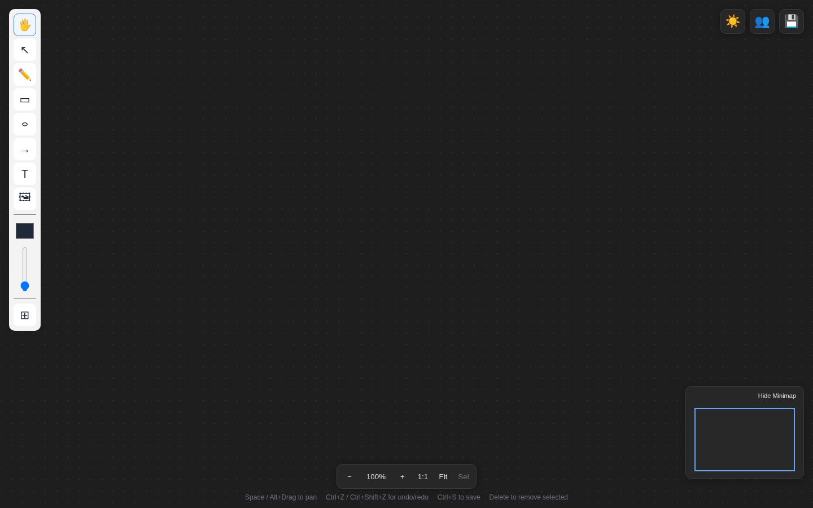
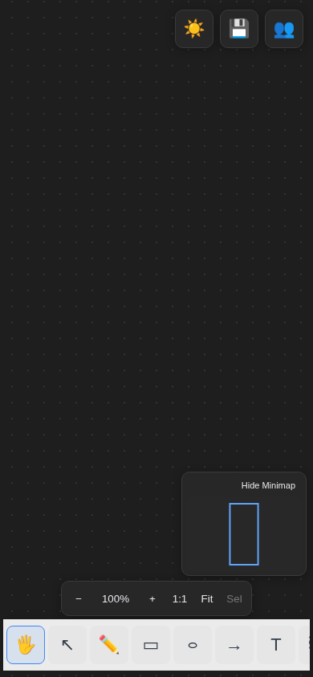

# Infinite Whiteboard

Infinite Whiteboard is a local-first, cross-platform canvas for sketching, diagramming, and collaborative planning. The same React application runs in the browser and is packaged for desktop with Tauri and mobile with Capacitor.

## Screenshots

| Desktop | Mobile |
| --- | --- |
|  |  |

## Features

- Draw paths, rectangles, ellipses, arrows, text, sticky notes, and images on an infinite zoomable canvas.
- Resize, rotate, group, lock, reorder, copy, duplicate, and snap selected objects, with undo and redo support.
- Format text and sticky notes with fonts, sizes, alignment, emphasis, lists, colors, and fills.
- Navigate large boards with search, a minimap, zoom controls, fit-to-content, and fit-to-selection.
- Manage multiple local boards. Boards autosave to IndexedDB and can be imported or exported as JSON.
- Export finished work as PNG or SVG.
- Collaborate through shareable rooms with live cursors, participant presence, connection status, and reconnect handling.
- Use responsive light and dark interfaces across web, desktop, and mobile.

## Quick Start

Install a current Node.js release and pnpm 10, then run:

```bash
pnpm install
pnpm --filter @whiteboard/web dev
```

Open `http://localhost:5173`. Local boards work without a server or account.

### Realtime Collaboration

Start the WebSocket service in a second terminal:

```bash
pnpm --filter @whiteboard/server dev
```

Development uses `ws://localhost:1234` by default. To use another service, set `VITE_COLLAB_WS_URL` in `apps/web/.env.local`:

```dotenv
VITE_COLLAB_WS_URL=wss://whiteboard.example.com
```

Enter the same room ID on each client or copy the generated share link. Rooms are held in memory unless filesystem persistence is enabled:

```bash
WHITEBOARD_PERSISTENCE_DIR=./whiteboard-data \
  pnpm --filter @whiteboard/server dev
```

Room links grant read/write access; there is currently no authentication. Use unguessable room IDs and HTTPS/WSS when deploying publicly.

## Desktop and Mobile

Tauri development requires Rust and the platform-specific Tauri prerequisites:

```bash
pnpm --filter @whiteboard/desktop dev
```

On Linux, `./dev-linux.sh` applies the recommended WebKit workaround. For mobile, install the native Capacitor platform once, build the web app, then sync and open it:

```bash
pnpm --filter @whiteboard/mobile exec cap add android  # or ios
pnpm --filter @whiteboard/web build
pnpm --filter @whiteboard/mobile sync
pnpm --filter @whiteboard/mobile android              # or ios
```

Android Studio or Xcode is required for the corresponding target.

## Keyboard Shortcuts

| Action | Shortcut |
| --- | --- |
| Select, pan, draw | `V`, `H`, `D` |
| Rectangle, ellipse, arrow | `R`, `E`, `A` |
| Text, sticky note, image | `T`, `N`, `I` |
| Undo / redo | `Ctrl/Cmd+Z`, `Ctrl/Cmd+Shift+Z` |
| Copy / duplicate | `Ctrl/Cmd+C`, `Ctrl/Cmd+D` |
| Group / ungroup | `Ctrl/Cmd+G`, `Ctrl/Cmd+Shift+G` |
| Search / save | `Ctrl/Cmd+F`, `Ctrl/Cmd+S` |
| Reset zoom / fit all / fit selection | `Ctrl/Cmd+0`, `Shift+1`, `Shift+2` |
| Remove selection | `Delete` or `Backspace` |

## Repository Layout

```text
apps/web       React + Vite application
apps/desktop   Tauri desktop shell
apps/mobile    Capacitor mobile shell
packages/core  Canvas engine, tools, history, geometry, and element types
packages/collab Yjs synchronization and presence
packages/export PNG, SVG, and JSON import/export
packages/ui    Shared components and styles
server         y-websocket collaboration service
tooling        Shared TypeScript configuration
plans          Historical feature specifications
```

## Development

| Command | Purpose |
| --- | --- |
| `pnpm test` | Run all Vitest suites through Turbo. |
| `pnpm build` | Build every package and application. |
| `pnpm --filter @whiteboard/core test -- <pattern>` | Run focused core tests. |
| `pnpm --filter @whiteboard/web preview` | Preview the production web build. |

Tests live beside source as `*.test.ts`. Keep canvas behavior framework-agnostic in `packages/core`, route mutations through history commands, and update rendering, snapping, export, and collaboration when adding an element type. See [AGENTS.md](AGENTS.md) for the complete contributor guide.
